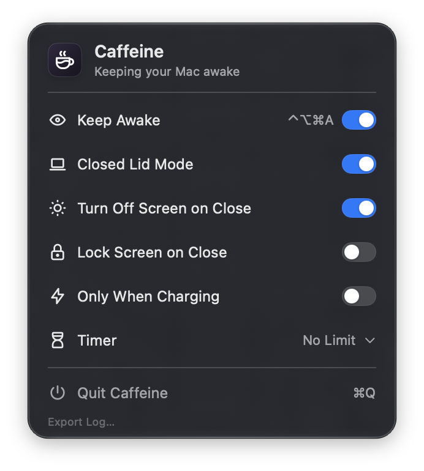
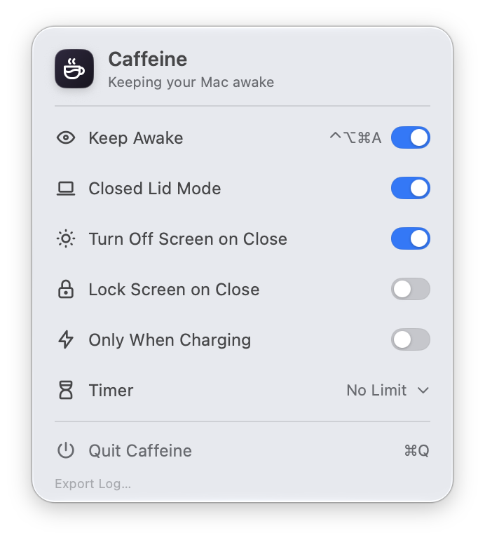

# Caffeine

Caffeine is a macOS menu bar app that keeps your Mac awake, including with the lid closed.

<p align="center">
  
  
</p>

## Features

- **Keep Awake** prevents idle system and display sleep. Turn it on and off in the menu bar card, or from any app with **⌃⌥⌘A**.
- **Closed Lid Mode** keeps the Mac awake with the lid closed while Keep Awake is on. It's on by default.
- **Turn Off Screen on Close** turns off only the built-in display when the lid closes while Keep Awake is active. External displays stay on. It's on by default.
- **Lock Screen on Close** locks the Mac when the lid closes while Keep Awake is active.
- **Only When Charging** keeps the Mac awake only while it's connected to external power.
- **Timer**: No Limit, 15 min, 30 min, 1 hour, 2 hours, 4 hours or 8 hours.
- A short sound confirms that Keep Awake is active.
- At first launch Caffeine sets itself to open at login, with Keep Awake off. You can turn this off in System Settings.
- **Export Log…** saves a diagnostic log to attach to a bug report.

## Requirements

- macOS 26 or later. Caffeine is developed and tested on macOS 27.
- Caffeine must run from `/Applications/Caffeine.app` to set up its background service.
- Turn Off Screen on Close and Lock Screen on Close need a Mac notebook. On a desktop Mac they do nothing.

## Installation

1. Download the app from the [latest release](../../releases/latest).
2. Move `Caffeine.app` to the Applications folder and open it from there.
3. The setup screen asks you to turn on Caffeine in **System Settings → General → Login Items & Extensions**. This allows its background service. macOS may ask for an administrator password.

Caffeine appears in the menu bar. Click the coffee cup to open its card.

## How it works

Caffeine has two parts: the menu bar app and a background service, `CaffeineHelper`. The service is a launchd daemon that the app registers with `SMAppService`. It runs as root, because only root can change the system-wide sleep setting that Closed Lid Mode needs.

- **Keep Awake.** The service holds two power assertions, against idle system sleep and idle display sleep, like `caffeinate -di`. Without Closed Lid Mode, no setting changes.
- **Closed Lid Mode.** The service also runs `pmset -a disablesleep 1`, and `pmset -a disablesleep 0` when the session ends, reading the setting back after each change. Before the first change it saves a recovery record in `/Library/Application Support/com.serhiital.Caffeine`. After a crash or a power loss, the service restores the setting from that record when it starts again. If sleep was already disabled by something else, Caffeine doesn't start Keep Awake, leaves the setting alone and says so.
- **Supervision.** A session belongs to the running app, which renews it every 5 seconds. If the app quits or crashes, the service ends the session at once; if the app stops responding, after 20 seconds. When the Mac goes to sleep, the service releases the hold; after the Mac wakes, the hold resumes with the app's next renewal. Quitting Caffeine waits until the service confirms that the sleep setting is restored. If that can't be confirmed, or the built-in display can't be turned back on, Caffeine stays open and shows what needs attention.
- **Lid actions** run in the app. Turn Off Screen on Close disconnects the built-in display through a display configuration that macOS reverts when the app exits; when the built-in display is the only one, it runs `pmset displaysleepnow` instead. Lock Screen on Close calls the system's lock screen function. Both features use private macOS interfaces, so a future macOS version may break them.

## Privacy

- Caffeine has no network code: no analytics, no telemetry and no update checks.
- Logs stay on your Mac: `~/Library/Logs/Caffeine/Caffeine.log` for the app and `/Library/Logs/Caffeine/CaffeineHelper.log` for the service. Each log keeps at most 1 MB plus four older files. The logs record Caffeine's actions and errors, never passwords, documents or screen contents.
- **Export Log…** saves both logs to a file you choose, with a summary: the versions of Caffeine and macOS, the Mac model, the settings, the service status and the names of recent crash reports. Nothing is sent anywhere.

## Security

The service accepts connections only from the Caffeine app signed by the same developer team, and the app talks only to the matching service. [SECURITY.md](SECURITY.md) describes the security model and how to report a vulnerability.

## Building from source

You need Xcode 27 or later and a signing certificate issued by Apple (see below). Clone the repository and open `Caffeine.xcodeproj`.

### Change the signing identity

The app and its service trust each other only through code signatures, and the expected identity is compiled into both. A build signed by another team can't set up or reach the service until you change the Team ID in both places listed below. Change the other values too, so that your build can't collide with the official app, and keep them consistent:

| Value | Now | Where to change it |
| --- | --- | --- |
| Team ID | `WQ33LA2JZ5` | Team in Signing & Capabilities of both targets, for Debug and Release (`DEVELOPMENT_TEAM`)<br>`teamIdentifier` in `Core/Sources/CaffeineServiceProtocol/ServiceProtocol.swift` |
| App identifier | `com.serhiital.Caffeine` | Bundle Identifier of the Caffeine target, for Debug and Release<br>`appIdentifier` in `ServiceProtocol.swift` |
| Service identifier | `com.serhiital.Caffeine.Helper` | Bundle Identifier of the CaffeineHelper target, for Debug and Release<br>`helperIdentifier` and `machService` in `ServiceProtocol.swift`<br>`Label` and the key under `MachServices` in the launchd plist |
| launchd plist name | `com.serhiital.Caffeine.Helper.plist` | The file in `Service/`; rename it in the Xcode project navigator so the Embed LaunchDaemon build phase keeps it<br>`daemonPlist` in `ServiceProtocol.swift` |
| Recovery folder | `/Library/Application Support/com.serhiital.Caffeine` | `productionDirectory` in `Core/Sources/CaffeineSystemPower/RecoveryJournal.swift` |

Keep these rules:

- The service identifier must be the same string in all five places: the helper's bundle identifier, `helperIdentifier`, `machService`, the plist's `Label` and its `MachServices` key. The helper is signed with its bundle identifier as its code signing identifier (`--identifier` in the helper's Other Code Signing Flags); keep that flag.
- `daemonPlist` must match the plist's file name.
- Sign both targets with an Apple-issued certificate of your team: Apple Development for your own Mac, Developer ID Application for builds you give to others. Both sides check the requirement `anchor apple generic and identifier "…" and certificate leaf[subject.OU] = "<Team ID>"`, which an ad hoc signature ("Sign to Run Locally") can't meet.
- Keep the product names `Caffeine` and `CaffeineHelper`. The app sets up its service only when it runs from `/Applications/Caffeine.app`, and the plist starts `Contents/MacOS/CaffeineHelper` (see `installationProblem` in `Caffeine/SystemServiceSetup.swift`).
- Signatures don't cover the recovery folder, but give your build its own, so it never shares recovery state with another copy of Caffeine.

### Build and run

Quit Caffeine if it's running, then build and install it:

```sh
xcodebuild -project Caffeine.xcodeproj -scheme Caffeine -configuration Debug -derivedDataPath build
rm -rf /Applications/Caffeine.app
ditto build/Build/Products/Debug/Caffeine.app /Applications/Caffeine.app
open /Applications/Caffeine.app
```

A running service hands over only to a replacement signed like itself. If a copy of Caffeine signed by another team was installed before, restart the Mac after installing your build, so that the old service process ends.

### Try the interface without the service

The **Caffeine UI Preview** scheme runs a Debug build with `--ui-preview`: a simulated session that works from any folder, installs nothing and changes no power setting. Turn on the `--preview-on-battery` argument in the scheme to simulate battery power.

### Run the tests

```sh
swift test --package-path Core
```

### When you change the service

- Every helper change you ship needs a higher `helperBuild` in `ServiceProtocol.swift` and, by convention, a higher build number (Current Project Version) in both targets. The app compares `helperBuild` with the running service and offers to update an older one once it's idle. The running service also restarts itself when a correctly signed replacement is installed and no session is active.
- A change to the messages (`ServiceRequest`, `ServiceReply`, `ServiceSnapshot`) also needs a higher `protocolVersion`.

## Project layout

| Path | Contents |
| --- | --- |
| `Caffeine/` | The menu bar app (SwiftUI) |
| `CaffeineHelper/` | The background service |
| `Core/` | Swift package with the session logic, service protocol, sleep backend, logging and their tests |
| `Service/` | The launchd property list embedded in the app |

## Uninstall

1. Choose **Quit Caffeine** (⌘Q) in its card. Quitting turns off Keep Awake and waits until the sleep setting is restored.
2. Delete `Caffeine.app` from Applications. macOS removes the service registration with it. If Caffeine is still listed in **System Settings → General → Login Items & Extensions**, turn it off there.
3. Restart the Mac, so that the service process ends if it's still running.
4. Check that sleep is allowed: `pmset -g | grep SleepDisabled` should print `0` or nothing. If it prints `1`, run `sudo pmset -a disablesleep 0`.
5. Optionally, remove the logs, the recovery folder and the preferences:

```sh
sudo rm -rf /Library/Logs/Caffeine "/Library/Application Support/com.serhiital.Caffeine"
rm -rf ~/Library/Logs/Caffeine
defaults delete com.serhiital.Caffeine
```

## Troubleshooting

- **"Install the signed Caffeine app in Applications…"** Move `Caffeine.app` to the Applications folder and open it from there.
- **"This build isn't signed for Caffeine's background service…"** The app's signature doesn't match `teamIdentifier` and `appIdentifier` in `ServiceProtocol.swift`, or the app is signed ad hoc. See [Building from source](#building-from-source).
- **"…restart your Mac to finish the update."** A service process from the replaced app is still running, and the new app can't verify it. A restart ends it.
- **Setup waits for approval.** Open **System Settings → General → Login Items & Extensions** and turn on Caffeine.
- **The Mac no longer sleeps.** Run `pmset -g | grep SleepDisabled`. If it prints `1` while Keep Awake is off, open Caffeine and follow its message; the service restores the setting from its recovery record. If Caffeine is no longer installed, run `sudo pmset -a disablesleep 0`. `pmset -g assertions` shows other apps that keep the Mac awake.
- **Reporting a bug.** Choose **Export Log…** in the card and attach the file to an issue.

## License

Caffeine is released under the [MIT License](LICENSE). The icons are [Tabler Icons](https://tabler.io/icons), also under the MIT License; see [THIRD_PARTY_NOTICES.md](THIRD_PARTY_NOTICES.md).
